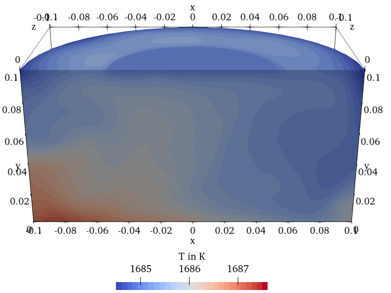
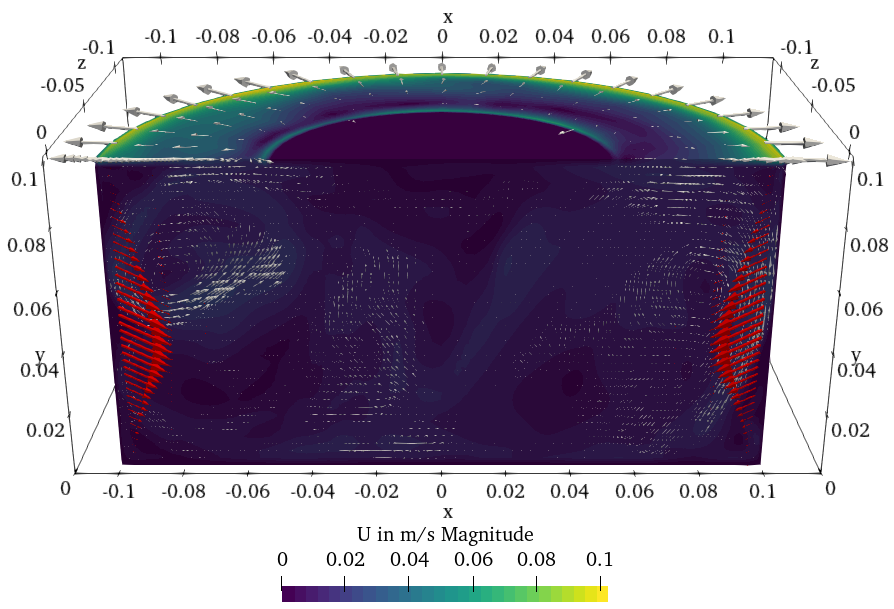
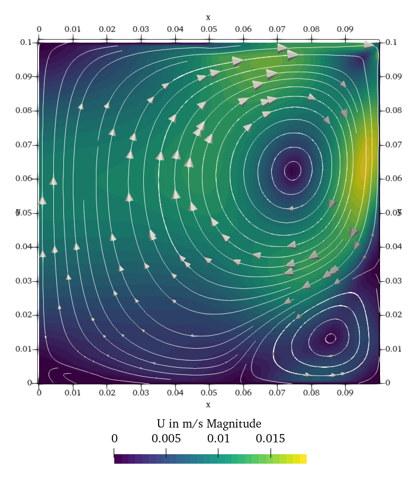

# Melt simulation with Elmer mapping

Tutorial case for the coupling utilities. Transient 3D thermal and melt flow simulation of a hypothetical silicon Czochralski melt with generated thermal boundary condition distributions, Joule heat field and Lorentz Force field. 

The project is developed and maintained by the [**Model experiments group**](https://www.ikz-berlin.de/en/research/materials-science/section-fundamental-description#c486) at the Leibniz Institute for Crystal Growth (IKZ).

## Prerequisites
This simulation was setup in OpenFOAM-v2212. Compilation of the applications in `/src/elmerFoamCoupling` is necessary. To compile use the `Allwmake`script.

## Geometry
The geometry is created with the utility [nemoblock](https://github.com/nemocrys/nemoblock). See `case3D/nemoblock-setup.py`. For this example, nemoblock is not needed, since the `blockMeshDict` is already provided.

## Mapping of external values
This tutorial shows the OpenFOAM side of possible coupling between Elmer and OpenFOAM. The data used here was not created by an Elmer simulation, but with a python script. Any data in this format can be used. In this tutorial, the input data is 2D and is mapped on a 3D mesh with axial symmetry.

- **boundary field values**: Mapping of the temperature or the temperature gradient is handled by [elmerToFoamBC](https://github.com/nemocrys/elmerToFoamBC). Example data is created by `case3D/createBCfiles.py`. Results are saved in *.dat files. These files have the sane structure as the `Save Line` subroutine of Elmer, which saves the boundary values as a line.

- **field values**: Mapping of the Joule heat Qj and Lorentz Force FL is handled by the file `createFieldsFromElmer.H` in the respective solver. Example data is created by `case3D/createFields.py`. Results are saved in a *.csv file.

## Azimuthal average of 3D velocity field
This tutorial showcases the `azimuthalAverage` utility. The resulting 2D velocity field can be imported into Elmer. Both meshes should be available in the same case. 
`runAzimuthalAveraging` creates the whole setup from two cases:
- case3D: This is the result that is azimuthaly averaged
- case2D: This is the 2D wedge case of the 3D case. Here, the 2D mesh is created that the azimuthal averaged 3D field is mapped to
- caseAveraged: This is the case with both meshes. The resulting averaged 2D field is created here. `icoFoam` is run for one time step to correct for continuity errors.

Further options are specified in the `azimuthalAverageDict` file.

## Results
### 3D temperature distribution

### 3D velocity distribution and Lorentz force vectors (in red)

### 2D azimuthally averaged velocity distribution

## Acknowledgements

[This project](https://nemocrys.github.io/) has received funding from the European Research Council (ERC) under the European Union's Horizon 2020 research and innovation programme (grant agreement No 851768).

